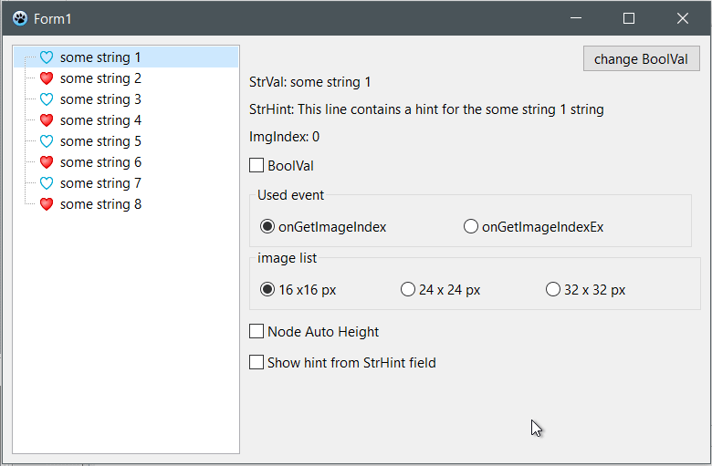
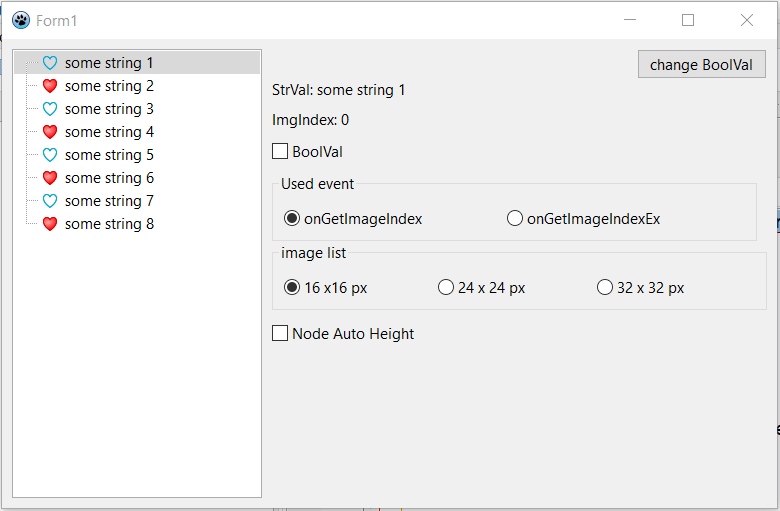

# laz_vtv_images

A test project to study how VST works with pictures. Stages of development (in reverse order):

*Added the display of a custom hint*

================================================

*Added the node's auto-height depending on the icon size*

================================================

*Added the ability to display icons from different imagelists*

================================================

